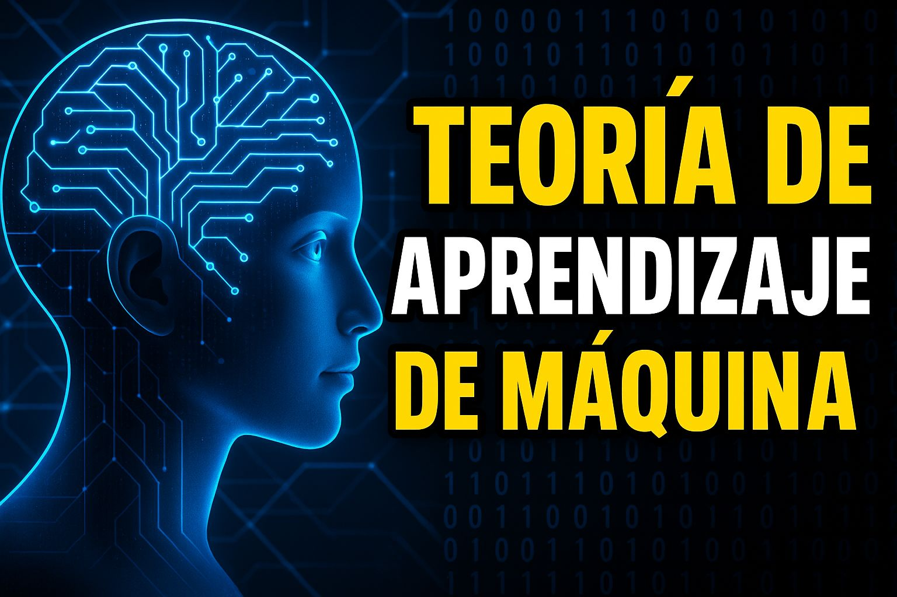
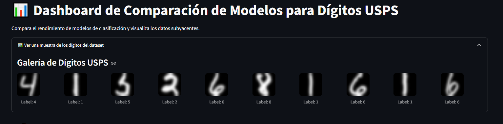
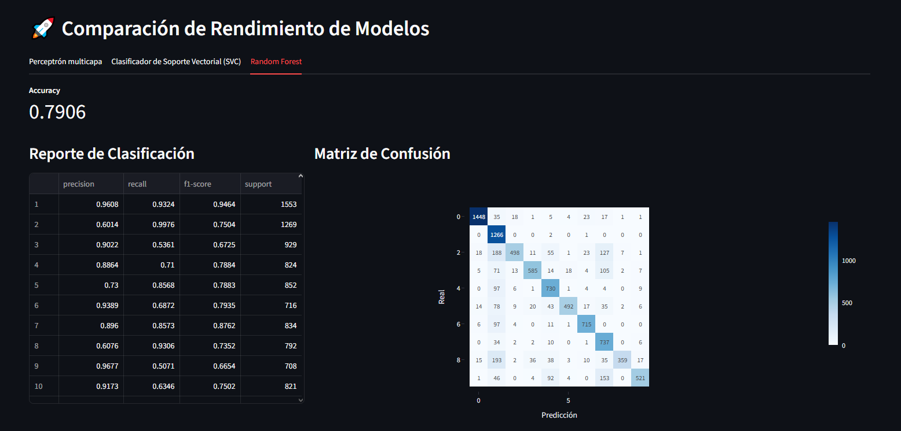
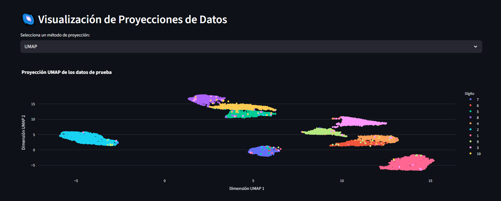
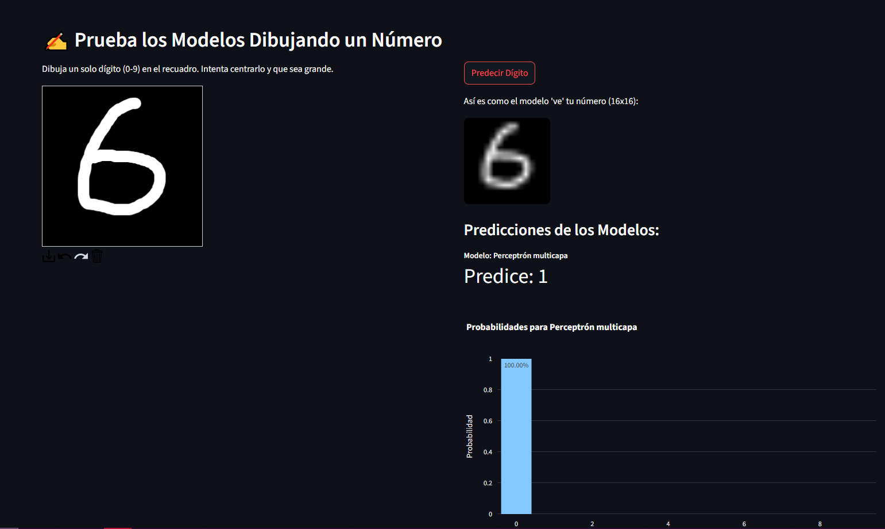

# Parcial 2 Teoría de Aprendizaje de Máquina

## Presentado por
* Johan Steven Bejarano
* Edwin Moran
* Juan Esteban Guevara

## Archivos

* **Parte1.pdf**: Corresponde al punto A y es la componente teórica.
* **parte2.ipynb**: Corresponde a los puntos b, c y d. Genera al final del notebook un link al dashboard en vivo.
* Video de youtube**: Corresponde al punto e:

## Video:
Por favor hacer click sobre la imagen

## Dashboard:

El dashboard se presenta primero con una pantalla de muestra de imagenes, donde nos podemos hacer una idea de como están conformadas las entradas de los modelos:

Posterior a ello encontraremos una comparativa del rendimiento de los modelos, y su capacidad para detectar cada uno de los números.

En la sección de Proyecciones se puede evidenciar cómo se visualiza una proyección PCA con UMAP:

Finalmente, hay una sección interactiva que permite dibujar un cierto número y realizar predicciones en base a este

